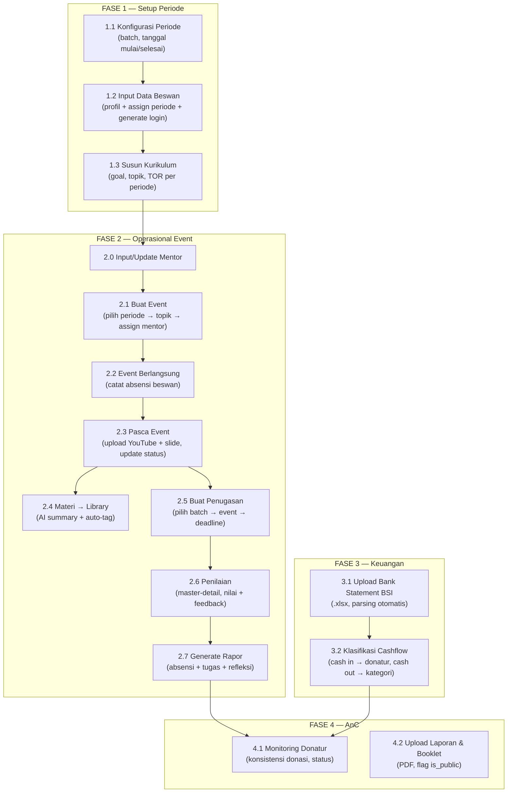
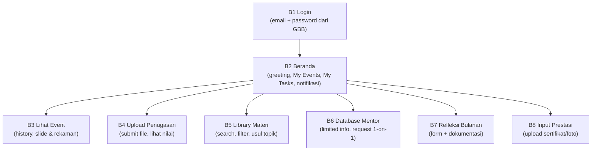
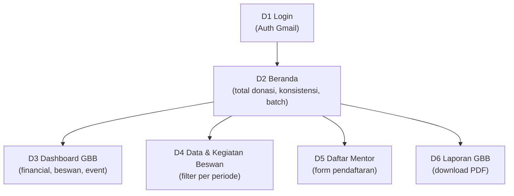

# Implementation Plan — Portal Web GBB (v3 Final)

> **Version**: 3.1 | **Date**: 20 Jun 2026 | **Status**: 🟢 Approved

---

## Goal

Membangun Portal Web GBB di `portal.baikberdampak.org` dengan 3 sub-portal (Internal, Beswan, Donatur). Front-end → back-end, checkpoint konfirmasi di setiap fase.

---

## Resolved Decisions ✅

| Item | Keputusan |
|------|-----------|
| **Server** | VPS Hostinger 16GB RAM, Linux, Nginx |
| **Domain** | `portal.baikberdampak.org` |
| **Database** | PostgreSQL self-hosted di VPS |
| **File Storage** | MinIO self-hosted di VPS (S3-compatible) |
| **Auth** | Better Auth — single login, role-based routing, develop last |
| **Refleksi** | 17 pertanyaan default dari PCM & AnC (seed, editable admin) — lihat [Refleksi Bulanan — Form](#refleksi-bulanan-beswan--form) |
| **Sheets Sync** | Donatur, Pendaftar Talkshow, Feedback → mirror via Google Sheets API |
| **Cashflow** | Upload bank statement BSI (.xlsx) + klasifikasi manual |

| **Role Viewer** | Viewer = akses read-only dashboard internal, tanpa edit. Role "media" dihapus |
| **Donatur Auth** | Gmail OAuth only, tanpa password_hash. Email di DB = patokan auto-match (`donatur.user_id`). Jika email ≠ → admin AnC link manual. Banner info di Beranda Donatur |
| **Event periode_id** | Event punya `periode_id` langsung. Kurikulum = auto-set dari topik, non-kurikulum = manual set |
| **AI Summary** | Masuk scope MVP — library auto-summary + auto-tag. **Provider configurable** di Settings → Konfigurasi AI (multi-provider via API key; default Claude) — lihat [AI Provider Configuration](#ai-provider-configuration) |
| **IG Highlights** | Embed dari IG @baikberdampak di Beranda Donatur |

✅ Tidak ada open question tersisa.

---

## Final Tech Stack

```
┌──────────────────────────────────────┐
│           FRONTEND (SPA)             │
│  React 18 + Vite + TypeScript        │
│  Shadcn/ui + Tailwind CSS v3         │
│  TanStack Table (data tables)        │
│  TanStack Router (SPA routing)       │
│  Recharts (dashboard charts)         │
│  React Hook Form + Zod (validation)  │
├──────────────────────────────────────┤
│           BACKEND (API)              │
│  Express.js + TypeScript             │
│  Drizzle ORM                         │
│  Better Auth (email/password + Gmail)│
│  Multer + MinIO SDK (file upload)    │
│  node-cron (scheduled sync)          │
│  xlsx (BSI bank statement parsing)   │
│  Resend (email service, free tier)   │
│  React Email (email templates)       │
│  AI SDK (Anthropic + OpenAI-compat)  │
├──────────────────────────────────────┤
│         INFRASTRUCTURE               │
│  PostgreSQL 16                       │
│  MinIO (S3-compatible storage)       │
│  Nginx (reverse proxy + SSL)         │
│  PM2 (process manager)               │
│  VPS Hostinger 16GB Linux            │
└──────────────────────────────────────┘
```

| Layer | Teknologi | Alasan |
|-------|-----------|--------|
| **Frontend** | React 18 + Vite | Cepat, ringan, SPA ideal untuk portal |
| **UI** | Shadcn/ui + Tailwind CSS | Futuristik, customizable, component-based |
| **Data Tables** | TanStack Table | Sort, filter, pagination, search — best-in-class |
| **Routing** | TanStack Router | Type-safe SPA routing, code splitting |
| **Forms** | React Hook Form + Zod | Validation kuat, TypeScript-first |
| **Charts** | Recharts | Dashboard visualisasi |
| **Backend** | Express.js + TS | Battle-tested, full control |
| **ORM** | Drizzle | SQL-like, type-safe, ringan, performa tinggi |
| **Auth** | Better Auth | Framework-agnostic, Drizzle adapter, role-based |
| **File Upload** | Multer + MinIO | Upload → MinIO buckets |
| **Scheduler** | node-cron | Google Sheets sync, alert checks, email reminders |
| **Excel Parser** | xlsx / ExcelJS | BSI bank statement parsing |
| **Email Service** | Resend | 3,000 emails/bulan gratis, API simple |
| **Email Templates** | React Email | JSX email templates, konsisten dengan UI |
| **AI (summary/tag)** | Anthropic SDK + OpenAI SDK (compat) | Multi-provider via `ai_config` — adapter native Claude + OpenAI-compatible (OpenAI/Gemini/OpenRouter/dll). Lihat [AI Provider Configuration](#ai-provider-configuration) |
| **PWA** | vite-plugin-pwa | Service worker, manifest, Workbox caching — auto-generate |
| **Offline DB** | idb | IndexedDB wrapper untuk offline data cache & upload queue |
| **Guided Tour** | React Joyride | Tutorial onboarding interaktif — tooltip + spotlight per role |

---

## Application Flow Summary

### Actor 1: Tim Internal (PCM / Finance / AnC)



### Actor 2: Beswan



### Actor 3: Donatur



---

## Key Business Rules

| Rule | Detail |
|------|--------|
| **Periode = 6 bulan fixed** | Hanya 2 opsi: **Jan–Jun** atau **Jul–Des**. Tidak ada variasi lain |
| **Multi-periode aktif** | Bisa >1 periode aktif bersamaan (jika pembinaan molor). Sistem harus support filter per periode |
| **Multi-batch beswan** | 1 beswan bisa di >1 periode. Artinya: punya >1 rapor, >1 set absensi, >1 set tugas (semua per periode) |
| **Beswan = 6 bulan** | Durasi beswan per periode = 6 bulan, sesuai periode |
| **Donatur daftar per periode** | Donatur daftar 1x per periode. Periode berikutnya → ditanya ulang. Tim AnC centang di portal jika lanjut |
| **Donatur kolom periode auto** | Kolom periode baru otomatis muncul di Database Donatur saat periode baru dikonfigurasi |
| **Kode donatur** | Auto-generated: `[Inisial][Semester][Tahun]`. Detail di bawah |
| **Absensi** | Dicatat oleh tim internal, bukan beswan |
| **Penugasan — buat** | PCM input judul, soal, **lampiran soal** (opsional PDF/DOCX/PPTX), deadline (tanggal+jam), `nilai_maks` (default 100). Publish → notif "tugas baru" + email ke semua beswan periode. Bisa diedit/dihapus setelah publish |
| **Penugasan submit** | 1 file jawaban; bisa **re-upload selama < deadline** (timpa file & `submitted_at` lama), **terkunci setelah deadline**. Belum submit & deadline lewat → boleh submit sekali, `terlambat=true`. `belum_kumpul` = virtual (left-join `beswan_periode` ⟕ `hasil_penugasan`) |
| **Penugasan nilai** | Skala **0–nilai_maks** + feedback teks → status `graded` + notif/email "tugas dinilai". Bisa **direvisi** (catat `graded_by`/`graded_at` terakhir). Endpoint `PATCH /hasil-penugasan/:id` |
| **Refleksi alert** | Wajib bulanan, terkoneksi periode batch |
| **Prestasi alert** | Wajib update per kuartal |
| **IPK update** | Beswan wajib update IP/IPK + transkrip tiap semester di Profile (1 entri per `periode_id`, tabel `beswan_ipk`). Alert di Beranda + email reminder. Sumber "Avg IPK" internal & IPK di Portal Donatur |
| **Donatur visibility** | Hanya lihat beswan dari periode di mana ia aktif |
| **Refleksi → donatur (AI curate)** | Donatur lihat ringkasan refleksi **hasil kurasi AI** (buang konten privat/tak pantas/menyerang GBB/akhlak buruk), cache di `refleksi.ringkasan_donatur`. AI gagal/kuota habis → verbatim + email `INTERNAL_ALERT_EMAILS`. Lihat [Kurasi Refleksi untuk Donatur](#kurasi-refleksi-untuk-donatur-ai) |
| **Greeting (beswan & donatur)** | Auto ganti tiap hari, **if-else (5 variasi), tanpa AI** |
| **Feedback event** | `feedback_event.beswan_id` **nullable** — feedback bisa dari peserta eksternal (Growth), simpan `nama_responden`/`email_responden` |
| **Mentor privacy** | Portal Beswan: tanpa HP & CV |
| **Login beswan** | Email + password (generated) |
| **Login donatur** | Gmail OAuth. Auto-match `donatur.email` → set `donatur.user_id`. Jika email tidak cocok: login sukses tapi akun belum terhubung. **Admin-link fallback**: AnC bisa manual set `donatur.user_id` di Database Donatur (dropdown user yang belum ter-link). Banner info di Beranda Donatur saat pertama login |
| **Donatur klasifikasi** | AnC assign donatur ke periode via `donatur_periode`. Donatur tanpa periode = alert di Monitoring & Database Donatur. Tiap awal semester (Jul-Agt, Des-Jan) reminder otomatis muncul agar AnC update keikutsertaan |
| **Parsing engine** | MVP: BSI. Metadata baris 1–10, **header baris 12, data baris 13+**; kolom A–I: `Date·FT Number·Description·Currency·Amount·DB·CR·Balance·Category`. **Abaikan blok ringkasan di kolom K+ ("SUMMARY…")**. CR terisi → `cash_in`, DB terisi → `cash_out` (**tipe dikunci dari file**). Bulan dari tanggal transaksi. Arsitektur **extensible per-bank** (profil pemetaan kolom), plus **error handling**: tolak file kalau format tak dikenali / sheet kosong |
| **Dedup cashflow** | Antar-upload (bukan dalam 1 file): kombinasi **FT Number + Nominal**. Baris yang sudah ada **tetap ditampilkan & dihitung di kartu DUPLIKAT tapi tidak disimpan**. Tanpa override manual. Baris yang FT Number-nya bukan format FT (mis. Biaya Adm `7280955285.11.202509`) → fallback dedup (tanggal + nominal + deskripsi) |
| **Auto-klasifikasi kategori** | Map kolom `Category` file (Donasi/Bagi Hasil/Biaya Adm Perbankan/Program/Biaya Transaksi/Pajak/dll) → `kategori_id`/`sub_kategori_id` di master `cashflow_kategori` (editable). Berlaku **semua baris** (in & out). Tetap bisa dikoreksi manual |
| **Jenis cash in** | Cash in = `Donasi` / `Pengembalian` / `Bagi Hasil` (dari Category, bisa dikoreksi). **Hanya `Donasi` yang butuh donatur**; lainnya cukup kategori |
| **Auto-match donatur** | Khusus cash in = Donasi: cocokkan deskripsi (umumnya lengkap, kadang nama terpotong) dengan nama donatur pakai **prefix/partial match** + normalisasi. **Tepat 1 cocok** → pre-fill `donatur_id` (`match_source = auto`). **>1 atau 0 cocok** → `unknown`. Bisa dikoreksi manual (`match_source = manual`). Opsi **Anonymous** (`is_anonymous`, tanpa auto-set) |
| **Status & simpan** | Status hanya `inputted`/`unknown` (tanpa pending). `inputted` = kategori terisi + (jika Donasi) donatur/anonymous dipilih. **Wajib 100% `inputted` sebelum Simpan** — semua transaksi pasti bisa diklasifikasi (tidak ada baris non-relevan) |
| **Edit & hapus cashflow** | Edit hanya koreksi klasifikasi (donatur/anonymous/kategori/sub-kategori) + `catatan` (notes finance opsional). **Tipe in/out, FT Number, nominal, tanggal dikunci** (ikut file — perbaiki via upload ulang). Ganti kategori Donasi → non-Donasi: kosongkan donatur. **Hapus baris**: konfirmasi pop-up + undo. Catat `updated_by` + `updated_at` (tanpa riwayat penuh). Endpoint `PATCH`/`DELETE /cashflow/:id` |
| **Akses Keuangan** | Admin: full (upload/klasifikasi/edit/hapus/kelola kategori). Finance: upload + klasifikasi + edit + hapus (konfirmasi) + kelola kategori. Viewer: read-only |
| **Event periode** | Setiap event wajib punya `periode_id`. Kurikulum = auto dari topik, non-kurikulum = manual set |
| **Donatur tags** | 7 tag status donatur (assign manual oleh AnC, 1 donatur bisa >1 tag). Tabel `donatur_tag` |
| **WA link monitoring** | `wa.me/{hp}?text={pesan}` — bukan WA API, hanya link pre-filled. **1 kolom Kirim** per donatur → pilih dari **banyak template** (buat/simpan/edit/hapus/re-order di Settings; tabel `pesan_template`, seed 2 template reminder & follow-up). **Emoji harus terbaca**: simpan UTF-8 + `encodeURIComponent` saat bangun link. Future (kalau memungkinkan, di luar MVP): integrasi WhatsApp langsung — AnC login WA sekali di portal, kirim pesan ter-template dari portal |
| **Donatur catatan** | Catatan internal per donatur, dikelola AnC |

### Kode Donatur — Auto-Generation Rules

**Format**: `[Inisial Nama][Semester Join][Tahun Join]`

| Komponen | Aturan | Contoh |
|----------|--------|--------|
| **Inisial** | Huruf pertama tiap kata, uppercase | Dendy Lisna Wansyah → `DLW` |
| **Semester** | `1` = Jan–Jun, `2` = Jul–Des | Jan–Jun → `1` |
| **Tahun** | 4 digit tahun join | 2025 → `2025` |

**Contoh verifikasi:**

| Nama | Kode | Breakdown |
|------|------|-----------|
| Dendy Lisna Wansyah | `DLW12025` | DLW + sem1 + 2025 |
| Ike Agustin Hartanto Putri | `IAH22024` | IAH + sem2 + 2024 |
| Yusuf Sufyan | `YS22024` | YS + sem2 + 2024 |
| Peni Anggraelin | `PA22024` | PA + sem2 + 2024 |
| Royhana | `R12025` | R + sem1 + 2025 |

**Edge cases:**

| Case | Aturan | Contoh |
|------|--------|--------|
| Nama 1 kata | Hanya 1 huruf inisial | Royhana → `R12025` |
| Nama panjang | Tetap ambil inisial semua kata | Muhammad Alfawza Biljannah → `MAB` |
| **Collision** | Extend inisial nama terakhir jadi 2 huruf; jika **masih** bentrok (prefix sama) → tambah sufiks angka (`-2`, `-3`, …) | Yusuf Sufyan → `YSU22024`, Yusuf Santoso → `YSA22024`; bentrok lagi → `YSU22024-2` |

### Kode Event — Auto-Generation Rules

**Format**: `EVT-[periode.nama]-[SeqNumber]`

| Komponen | Aturan | Contoh |
|----------|--------|--------|
| **Prefix** | Selalu `EVT` | `EVT` |
| **periode.nama** | Diambil dari `periode.nama` (dinamis, e.g. BBB4, BBB5, BBB6) | `BBB4`, `BBB6` |
| **SeqNumber** | Auto-increment 2 digit per periode, mulai dari `01` | `01`, `02`, `13` |

**Contoh**: `EVT-BBB4-01`, `EVT-BBB5-03`, `EVT-BBB6-01`

**Reset**: SeqNumber reset ke `01` setiap periode baru.

### Kode Penugasan — Auto-Generation Rules

**Format**: `TGS-[periode.nama]-[SeqNumber]`

| Komponen | Aturan | Contoh |
|----------|--------|--------|
| **Prefix** | Selalu `TGS` | `TGS` |
| **periode.nama** | Diambil dari `periode.nama` (dinamis, e.g. BBB4, BBB5, BBB6) | `BBB4`, `BBB6` |
| **SeqNumber** | Auto-increment 2 digit per periode, mulai dari `01` | `01`, `02` |

**Contoh**: `TGS-BBB4-01`, `TGS-BBB5-02`, `TGS-BBB6-01`

---

## Password Management — Beswan

| Flow | Detail |
|------|--------|
| **Generate** | Saat akun dibuat, sistem generate password acak 8 karakter (huruf + angka). Dikirim via welcome email |
| **First Login** | Beswan login → wajib lengkapi profil (HP wajib, CV opsional, **IPK semester berjalan wajib**). Direkomendasikan ganti password |
| **Change Password** | Di halaman Profile → form old password + new password + confirm. Min 8 karakter |
| **Forgot Password** | Di halaman login → input email → kirim reset link via Resend (expired 1 jam) → set new password |

---

## Update IPK Beswan — per Semester

| Item | Detail |
|------|--------|
| **Di mana** | Halaman Profile beswan |
| **Apa** | IP semester berjalan + IPK kumulatif + upload transkrip (bukti) |
| **Kapan** | Wajib tiap semester — 1 entri per `periode_id` (tabel `beswan_ipk`, unique `beswan_id + periode_id`) |
| **Reminder** | Alert banner di Beranda + email cron jika belum update di periode aktif |
| **Dipakai** | Metric "Avg IPK" (Database Beswan internal) & angka IPK per beswan di Portal Donatur (ambil baris periode terbaru) |

---

## File Upload Limits

| Konteks | Allowed Types | Max Size |
|---------|--------------|----------|
| **CV Beswan** | PDF | 5 MB |
| **CV Mentor** | PDF | 5 MB |
| **Foto Beswan** | JPG, PNG | 2 MB |
| **Penugasan — lampiran soal** | PDF, DOCX, PPTX | 10 MB |
| **Penugasan (submit jawaban)** | PDF, DOCX, XLSX, PPTX | 10 MB |
| **Sertifikat/Foto Prestasi** | PDF, JPG, PNG | 5 MB per file |
| **Slide Materi (event)** | PDF, PPTX | 20 MB |
| **Laporan/Booklet** | PDF | 50 MB |
| **Bank Statement BSI** | XLSX | 10 MB |
| **Dokumentasi Refleksi** (multi-file) | PDF, JPG, PNG | 5 MB per file |
| **Transkrip Nilai (IPK)** | PDF, JPG, PNG | 5 MB |
| **TOR Kurikulum** | PDF, DOCX | 10 MB |

**Storage**: MinIO buckets terpisah per tipe:
- `beswan-files` — foto & CV beswan, **transkrip IPK**, **dokumentasi refleksi**, sertifikat/foto prestasi
- `mentor-files` — CV mentor
- `event-materials` — slide materi + **TOR kurikulum**
- `assignments` — file submit penugasan
- `reports` — laporan & booklet
- `bank-statements` — mutasi BSI

---

## In-App Notification System

| Item | Detail |
|------|--------|
| **Mekanisme** | Polling via REST API setiap 30 detik |
| **Endpoint** | `GET /api/notifications?unread=true` → return count + list |
| **UI** | Bell icon 🔔 di header semua portal. Badge merah jika ada unread |
| **Klik bell** | Dropdown list notifikasi (max 10 terbaru). Klik item → mark as read + navigate ke ref |
| **Mark all read** | Tombol "Tandai semua dibaca" di dropdown |
| **Storage** | Tabel `notifikasi` — `recipient_type` + `recipient_id` + `ref_table` + `ref_id` |
| **Cleanup** | Cron hapus notifikasi > 90 hari |

**Kenapa polling, bukan WebSocket**: traffic portal rendah (<100 concurrent users), polling 30 detik cukup responsif dan jauh lebih simple untuk maintain di VPS single-server. WebSocket bisa ditambahkan nanti jika perlu real-time.

---

## PWA Strategy

**Tech**: `vite-plugin-pwa` (Workbox built-in) + `idb` (IndexedDB wrapper)

### Caching Strategy

| Request Type | Strategy | Detail |
|-------------|----------|--------|
| `/api/*` | Network-first | Coba network dulu, fallback ke cache jika offline |
| Static assets (JS/CSS/images) | Cache-first | Serve dari cache, update di background |
| Fonts (Plus Jakarta Sans) | Cache-first | Self-hosted, cache permanent |
| PWA icons | Cache-first | Tidak pernah berubah |

### Offline Capabilities per Portal

| Portal | Offline Behavior |
|--------|-----------------|
| **Internal** | Dashboard read-only dari snapshot cache. Editing disabled + banner "Anda offline" |
| **Beswan** | View cached data (event, tugas, library). Upload penugasan & refleksi masuk queue → auto-retry saat online |
| **Donatur** | OAuth harus online untuk login pertama. Setelah login: cached portal read-only (dashboard, data beswan, laporan) |

### Service Worker Lifecycle
- Install: pre-cache app shell + critical assets
- Activate: cleanup old caches
- Fetch: route-based strategy (network-first API, cache-first assets)
- Background Sync: flush upload queue & fetch notifikasi saat online kembali

### Offline UX
- `<OfflineIndicator />`: banner di atas halaman saat offline
- `useOffline()` hook: detect connection status, disable write actions
- Upload queue: badge "Menunggu koneksi" pada item yang pending sync
- Notifikasi: stop polling saat offline, Background Sync API untuk fetch saat reconnect
- Stale data indicator: "Terakhir diperbarui: [waktu]" pada cached content

### Manifest

```json
{
  "name": "Portal Beasiswa Baik Berdampak",
  "short_name": "Portal GBB",
  "start_url": "/",
  "display": "standalone",
  "theme_color": "#f56a1f",
  "background_color": "#ffffff",
  "icons": [
    { "src": "/icons/icon-192x192.png", "sizes": "192x192", "type": "image/png" },
    { "src": "/icons/icon-512x512.png", "sizes": "512x512", "type": "image/png" }
  ]
}
```

---

## Instagram Highlights — Beranda Donatur

| Item | Detail |
|------|--------|
| **Akun** | `@baikberdampak` |
| **Metode** | Instagram oEmbed API (gratis, tanpa auth) |
| **Endpoint** | `https://graph.facebook.com/v18.0/instagram_oembed?url={post_url}` |
| **Tampilan** | 3 post terbaru, horizontal scroll cards |
| **Fallback** | Jika API gagal / rate limit → tampilkan link ke profil IG |
| **Update** | Tim internal input URL post IG di Settings / Konfigurasi (manual, bukan auto-fetch) |

---

## AI Provider Configuration

Fitur AI memanggil provider yang dipilih admin di **Settings → Konfigurasi AI**. Konfigurasi disimpan di tabel `ai_config`. **Konsumen AI:**
1. **Auto-summary + auto-tag Library** (saat upload materi)
2. **Kurasi ringkasan refleksi untuk Portal Donatur** (saat beswan submit refleksi) — lihat [Kurasi Refleksi untuk Donatur](#kurasi-refleksi-untuk-donatur-ai)

### Arsitektur adapter
- Interface `AiProvider { summarize(text), tag(text), curate(text, rules) }` dengan 2 implementasi:
  - **`anthropic`** — Anthropic SDK native (default; model Claude terbaru)
  - **`openai_compatible`** — OpenAI SDK dengan `base_url` + `model` + `apiKey` custom → satu adapter ini menjangkau **OpenAI, Google Gemini (endpoint OpenAI-compat), OpenRouter (ratusan model), DeepSeek, Groq, LM Studio/Ollama lokal**, dll
- Tambah provider baru = tambah/atur baris `ai_config`, **tanpa ubah kode** (selama OpenAI-compatible)

### Settings UI (admin only)
- Pilih provider, isi `label`, `model`, `base_url` (opsional untuk compat), `api_key`
- Tombol **Test koneksi** sebelum simpan
- Tandai 1 baris **aktif** — itu yang dipakai fitur AI

### Keamanan & keandalan
- `api_key` **dienkripsi at-rest** (mis. AES dengan app secret), didekripsi **hanya di server**, tidak pernah ke client / log (NFR §12)
- **Fallback**: jika API gagal/timeout, materi tetap tersimpan **tanpa** summary/tag (non-blocking), ditandai "AI pending", bisa retry manual
- **Hemat biaya**: summary dibuat **sekali saat upload**, hasil disimpan di `library.ai_summary` (tidak panggil ulang tiap view)

### Kurasi Refleksi untuk Donatur (AI)

Donatur **tidak** boleh membaca refleksi mentah beswan. AI mengubahnya jadi ringkasan layak-donatur.

| Item | Detail |
|------|--------|
| **Trigger** | Saat beswan **submit** refleksi (atau cron batch untuk yang `pending`) |
| **Input** | Jawaban refleksi bulan tsb (field naratif: kegiatan, prestasi, insight, dll) |
| **Aturan kurasi (prompt)** | Buang/ samarkan: (a) info terlalu privat/sensitif, (b) konten tidak pantas dibaca donatur, (c) yang menyerang/menjelekkan GBB, (d) yang menunjukkan akhlak buruk beswan. Output = narasi progress singkat, jujur, sopan |
| **Simpan** | `refleksi.ringkasan_donatur` (text) + `refleksi.ringkasan_status` (`pending`/`curated`/`fallback`). Di-cache — tidak panggil ulang tiap donatur buka |
| **Tampil ke donatur** | Portal Donatur §D4 menampilkan `ringkasan_donatur` (status `curated`). Status `fallback` → tampilkan jawaban apa adanya (verbatim) |
| **Fallback (AI gagal/kuota habis)** | (1) set `ringkasan_status = fallback` → donatur lihat verbatim; (2) **kirim email peringatan ke SELURUH tim internal** (lihat Internal Alert Distribution) agar segera cek/perbaiki provider AI & review manual |

### Internal Alert Distribution (AI gagal / kuota habis)

Email peringatan dikirim ke seluruh tim internal. Daftar disimpan sebagai env config `INTERNAL_ALERT_EMAILS` (bukan hardcode), seed awal:

```
alumnicollaboration@baikberdampak.org
dewijihan@baikberdampak.org
digital@baikberdampak.org
fathan@baikberdampak.org
itsupport@baikberdampak.org
legalfinance@baikberdampak.org
people@baikberdampak.org
program@baikberdampak.org
riskypriscilia@baikberdampak.org
```

> Dipakai juga untuk peringatan operasional lain ke tim internal (mis. AI Library gagal berulang, sync error). Idempoten: jangan spam — cukup 1 email per insiden/window (lihat Idempotensi cron).

---

## Rapor Beswan

### Format
- **View di portal** (halaman web) + **Download PDF** (generate via Puppeteer / `@react-pdf/renderer`)
- 1 rapor = 1 beswan × 1 periode

### Template Rapor

```
┌─────────────────────────────────────────────────────┐
│  RAPOR PEMBINAAN BESWAN                             │
│  Beasiswa Baik Berdampak (GBB)                      │
│                                                     │
│  Nama    : Ahmad Fauzi                              │
│  NIM     : 21120122140xxx                           │
│  Batch   : BBB4 (Jul–Des 2025)                      │
│  Status  : Aktif                                    │
├─────────────────────────────────────────────────────┤
│                                                     │
│  1. RINGKASAN KEHADIRAN                             │
│  ┌───────────────────────────────┬───────┐          │
│  │ Event                        │ Hadir │          │
│  ├───────────────────────────────┼───────┤          │
│  │ CV Writing Workshop          │  ✅   │          │
│  │ Public Speaking Talkshow     │  ✅   │          │
│  │ Interview Prep               │  ❌   │          │
│  ├───────────────────────────────┼───────┤          │
│  │ Total: 2/3 (67%)             │       │          │
│  └───────────────────────────────┴───────┘          │
│                                                     │
│  2. PENUGASAN                                       │
│  ┌──────────────────────┬───────┬──────────┐        │
│  │ Tugas                │ Nilai │ Status   │        │
│  ├──────────────────────┼───────┼──────────┤        │
│  │ Essay Public Speaking│  85   │ Graded   │        │
│  │ Refleksi CV          │  90   │ Graded   │        │
│  ├──────────────────────┼───────┼──────────┤        │
│  │ Rata-rata: 87.5      │       │          │        │
│  └──────────────────────┴───────┴──────────┘        │
│                                                     │
│  3. REFLEKSI BULANAN                                │
│  ┌──────────┬──────────┐                            │
│  │ Bulan    │ Status   │                            │
│  ├──────────┼──────────┤                            │
│  │ Juli     │ ✅ Sudah │                            │
│  │ Agustus  │ ✅ Sudah │                            │
│  │ September│ ❌ Belum │                            │
│  └──────────┴──────────┘                            │
│                                                     │
│  4. PRESTASI                                        │
│  • Juara 2 Lomba Debat Nasional (Okt 2025)          │
│  • Ketua BEM Fakultas (2025/2026)                   │
│                                                     │
├─────────────────────────────────────────────────────┤
│  Generated: 17 Jun 2026 | portal.baikberdampak.org  │
└─────────────────────────────────────────────────────┘
```

### Scalability
- Template modular: setiap section (kehadiran, penugasan, refleksi, prestasi) = komponen terpisah
- Jika beswan multi-batch → rapor terpisah per periode, bisa diakses via dropdown periode
- Jika event sangat banyak (>20) → tabel paginated di web view, di PDF tetap full list
- Rapor bisa di-generate ulang kapan saja (data real-time dari DB)

---

## Refleksi Bulanan Beswan — Form

Form refleksi yang wajib diisi beswan setiap bulan (Step B7 / Phase 2E). 17 pertanyaan di bawah adalah **set bawaan (seed)** dari PCM & AnC — admin internal tetap bisa tambah / edit / hapus / re-order pertanyaan via form builder.

### Struktur penyimpanan
- **`refleksi_pertanyaan`** — template pertanyaan (konfigurabel admin): `id`, `urutan`, `seksi`, `label`, `field_type`, `wajib`, `opsi` (JSON, untuk dropdown/single_choice/linear_scale), `kondisi` (JSON, untuk pertanyaan bersyarat), `aktif`. Di-seed dengan 17 baris di bawah.
- **`refleksi`** — submission per beswan × bulan × periode: `id`, `beswan_id`, `periode_id`, `bulan`, `tahun`, `status` (draft/submitted), `submitted_at`. Dokumentasi multi-file disimpan sebagai jawaban pertanyaan `dokumentasi` di `refleksi_jawaban` (JSON array URL); transkrip nilai pindah ke `beswan_ipk`.
- **`refleksi_jawaban`** — jawaban per pertanyaan: `id`, `refleksi_id`, `pertanyaan_id`, `nilai` (text/JSON).

> Karena pertanyaan editable, jawaban di-link via `pertanyaan_id` (bukan kolom fixed) agar perubahan template tidak merusak data historis. Rapor membaca status sudah/belum submit per bulan; isi jawaban tampil di detail beswan (tim internal) & ringkasan di Portal Donatur.

### Field types
`short_text` · `long_text` (paragraf) · `dropdown` · `single_choice` (radio) · `linear_scale` · `file_upload`

### Seed pertanyaan (default)

| # | Seksi | Pertanyaan | Field type | Wajib | Opsi / Catatan |
|---|-------|-----------|------------|:-----:|----------------|
| 1 | Identitas Dasar | Nama lengkap | short_text | ✅ | — |
| 2 | Identitas Dasar | Periode laporan bulan | dropdown | ✅ | Januari–Desember |
| 3 | Aktivitas Bulanan | Kegiatan apa saja yang kamu ikuti selama bulan ini? | long_text | ✅ | — |
| 4 | Aktivitas Bulanan | Apakah kamu mengikuti lomba/kompetisi/seminar/workshop? | single_choice | ✅ | Ya / Tidak |
| 5 | Aktivitas Bulanan | Jika iya, sebutkan nama kegiatan/lomba/seminar/workshop yang diikuti. | long_text | ⬜ | Tampil jika Q4 = Ya |
| 6 | Aktivitas Bulanan | Prestasi atau pencapaian apa yang diraih bulan ini? | short_text | ⬜ | — |
| 7 | Aktivitas Bulanan | Apakah ada kepanitiaan, organisasi, program kerja, volunteer, part time, atau bisnis yang sedang dijalankan? | single_choice | ✅ | Ada / Tidak ada |
| 8 | Aktivitas Bulanan | Jelaskan singkat kontribusi atau peranmu dalam kegiatan tersebut. | long_text | ⬜ | Tampil jika Q7 = Ada |
| 9 | Refleksi & Evaluasi | Sejauh mana target bulan lalu berhasil kamu capai? | single_choice | ✅ | Tercapai semua / Sebagian besar tercapai / Sebagian kecil tercapai / Tidak tercapai / Belum ada target sebelumnya |
| 10 | Refleksi & Evaluasi | Ceritakan singkat alasan di balik jawabanmu di atas — apa yang membuat target itu tercapai atau tidak tercapai? | long_text | ⬜ | — |
| 11 | Refleksi & Evaluasi | Pelajaran atau insight personal apa yang kamu dapatkan bulan ini tentang dirimu sendiri (kebiasaan belajar, manajemen waktu, relasi, cara mengambil keputusan, dll)? | long_text | ✅ | — |
| 12 | Refleksi & Evaluasi | Apa aktivitas yang paling berkesan atau paling bermanfaat bulan ini, dan mengapa? | long_text | ⬜ | — |
| 13 | Refleksi & Evaluasi | Beri skor kepuasanmu terhadap produktivitas bulan ini. | linear_scale | ✅ | 1–10 (1 = Sangat tidak puas, 10 = Sangat puas) |
| 14 | Refleksi & Evaluasi | Kendala apa yang kamu hadapi selama bulan ini? | long_text | ⬜ | — |
| 15 | Refleksi & Evaluasi | Target atau rencana yang ingin dicapai bulan depan? | long_text | ✅ | — |
| 16 | Rencana & Masukan | Masukan atau saran untuk program Beswan. | long_text | ⬜ | — |
| 17 | Dokumentasi | Upload dokumentasi kegiatan/lomba bulan ini. | file_upload | ✅ | dokumentasi kegiatan wajib, multi-file foto/PDF (lihat File Upload Limits). Transkrip nilai → Profile/IPK |

**Catatan:**
- Penomoran asli melompati nomor 9 → sudah dirapikan jadi 1–17 berurutan.
- Q1 (nama) & Q2 (bulan) bisa di-auto-fill dari profil beswan + periode aktif; tetap dipertahankan di template agar admin bebas mengubah.
- Q5 & Q8 bersyarat (conditional) — hanya muncul saat pertanyaan pemicunya dijawab "Ya"/"Ada".

---

## Data Migration Plan

### Source Data (Google Sheets → PostgreSQL)

| Sheet | Target Table | Strategi |
|-------|-------------|----------|
| **Database Donatur** | `donatur` + `donatur_periode` | One-time import profil (sampai kolom Akun Media Sosial). Kode donatur auto-generate. Status periode di-set manual oleh AnC setelah import |
| **Pendaftar Talkshow** | `event` + `event_beswan` | Map ke event & attendance records. Data historis yang tidak match event → arsip |
| **Feedback Talkshow** | `feedback_event` | Map ke event terkait. Feedback tanpa event match → skip |
| **Cashflow (jika ada)** | `cashflow` | One-time import, klasifikasi ulang jika perlu |

### Migration Steps

1. **Pre-migration**: Freeze editing di Google Sheets selama proses
2. **Export**: Download semua sheet sebagai CSV
3. **Transform**: Script Node.js untuk:
   - Normalisasi format (tanggal, nominal, nama)
   - Generate kode donatur
   - Validasi unique constraints (email, NIM); dedup cashflow = **FT Number + Nominal** (bukan FT Number saja)
   - Map relasi (donatur → periode, event → topik)
4. **Load**: Insert ke PostgreSQL via Drizzle
5. **Verify**: Cross-check jumlah row, spot-check 10% data secara manual
6. **Post-migration**: Google Sheets sync cron mulai jalan (mode mirror, bukan replace)

### Timeline
- Migration script development: bersamaan dengan Phase 4A (schema setup)
- Dry run: sebelum Phase 5 (integration)
- Production migration: saat deployment (Phase 6)

---

## Project Structure (Anti-Hallucination Strategy)

> Prinsip: **isolasi per portal, 1 file < 200 baris, schema per domain**

```
GBB/
├── client/public/
│   ├── manifest.json               # PWA manifest
│   ├── icons/                      # PWA icons (16, 32, 192, 512, apple-touch)
│   └── fonts/                      # Plus Jakarta Sans (self-hosted)
├── client/src/                     # React + Vite frontend
│   ├── sw.ts                       # Service Worker (via vite-plugin-pwa)
│   ├── components/
│   │   ├── ui/                     # Shadcn (Button, Input, Modal, dll)
│   │   └── shared/                 # MetricCard, Sidebar, Badge, DataTable, OfflineIndicator, GuidedTour
│   ├── portals/
│   │   ├── internal/               # Portal Internal (isolated)
│   │   │   ├── layout.tsx
│   │   │   └── pages/              # 1 folder per halaman
│   │   │       ├── dashboard/      # index + EventTab + AnalitikBeswanTab + TrendDonaturTab + GrowthTab
│   │   │       ├── beswan/         # index + Table + Detail + Rapor
│   │   │       ├── kurikulum/
│   │   │       ├── mentor/
│   │   │       ├── event/
│   │   │       ├── penugasan/
│   │   │       ├── keuangan/       # rekonsiliasi/ + overview/ + database-donatur/ + monitoring/
│   │   │       └── settings/       # users/ + template-wa/ + master-kategori/ + konfigurasi-ai/
│   │   ├── beswan/                 # Portal Beswan (isolated)
│   │   │   ├── layout.tsx
│   │   │   └── pages/              # beranda/ library/ mentor/ refleksi/ profile/
│   │   └── donatur/                # Portal Donatur (isolated)
│   │       ├── layout.tsx
│   │       └── pages/              # beranda/ mentor/ dashboard/ beswan/ laporan/
│   ├── hooks/                      # Shared hooks (+ useOffline.ts, useTour.ts)
│   ├── lib/                        # API client, utils, offline.ts, idb.ts
│   │   └── tours/                  # Tour definitions per portal (internal.ts, beswan.ts, donatur.ts)
│   ├── styles/                     # Global CSS, theme tokens
│   └── types/                      # Shared TypeScript types
│
├── server/src/                     # Express backend
│   ├── db/
│   │   ├── schema/                 # 1 file per domain
│   │   │   ├── core.ts             # periode, users
│   │   │   ├── beswan.ts           # beswan, beswan_periode, beswan_ipk, refleksi_pertanyaan, refleksi, refleksi_jawaban, prestasi, prestasi_file
│   │   │   ├── donatur.ts          # donatur, donatur_tag, donatur_periode
│   │   │   ├── mentor.ts           # mentor, mentor_request
│   │   │   ├── event.ts            # topik, event, event_mentor, event_beswan, feedback_event
│   │   │   ├── penugasan.ts        # penugasan, hasil_penugasan
│   │   │   ├── cashflow.ts         # cashflow, cashflow_kategori
│   │   │   ├── library.ts          # library, topik_usulan
│   │   │   ├── sistem.ts           # laporan, notifikasi, pesan_template, pendaftar_event, ai_config
│   │   │   └── index.ts            # barrel export
│   │   └── migrations/
│   ├── routes/                     # 1 file per entity
│   ├── services/                   # Business logic per domain
│   ├── email/                      # Resend + React Email templates
│   ├── cron/                       # Scheduled jobs
│   ├── middleware/                  # Auth, error handling
│   └── lib/                        # Utilities
│
└── docs/                           # Planning docs (existing)
```

### Development Rules

| Rule | Detail |
|------|--------|
| **Kerja per halaman** | Fokus 1 halaman per sesi, baca hanya file relevan |
| **File max ~200 baris** | Pecah komponen besar ke sub-components |
| **Portal terisolasi** | Internal, Beswan, Donatur tidak saling import |
| **Shared components reusable** | Dibuat di Phase 0, reuse di semua portal |
| **Schema per domain** | Bukan 1 file raksasa, import via barrel `index.ts` |
| **Types centralized** | Shared types di `types/`, per-page types inline |

---

## Delivery Phases

### Phase 0: Foundation & Setup
- Init monorepo: `/client` (React+Vite) + `/server` (Express)
- Tailwind + Shadcn/ui setup
- Design system: theme, color palette, typography
- Reusable UI components (Button, Input, Table, Card, Modal, Sidebar, MetricCard, Badge, Alert)
- Express boilerplate + Drizzle config
- **Desain model RBAC sejak awal**: peran (`users.role`) + matriks akses + helper guard server-side didefinisikan di Phase 0 (provider Better Auth diwire di Phase 4B). RBAC = risiko #1 (PRD §14), jangan ditempel di akhir

### Phase 0B: PWA Foundation (paralel Phase 0)
- `vite-plugin-pwa` setup (auto-generate SW + manifest)
- Service Worker: Network-first `/api/*`, Cache-first static assets
- `public/manifest.json`: name, icons, theme_color `#f56a1f`, background_color `#ffffff`, display `standalone`
- PWA icons: 16x16, 32x32, 192x192, 512x512, apple-touch-icon
- Self-host Plus Jakarta Sans di `public/fonts/` (offline font loading)
- HTML meta tags: theme-color, mobile-web-app-capable, manifest link
- `useOffline()` hook + `<OfflineIndicator />` component
- IndexedDB wrapper (`idb` library) untuk offline cache & upload queue

### Phase 1: Front-End Portal Internal ✋
- **1A** Layout & sidebar (6 menu + dashboard)
- **1B** Database Beswan (metrics, table, detail, rapor)
- **1C** Kurikulum & Library (tabs, upload, tagging)
- **1D** Database Mentor (metrics, table, detail, feedback)
- **1E** Event Talkshow (metrics, table, create wizard, alert)
- **1F** Penugasan (master-detail, create wizard, grading)
- **1G** Dashboard (4 tabs: Event, Analitik Beswan, Trend Donatur, Growth)
- **1H** Keuangan (BSI upload, klasifikasi, master kategori, Overview Keuangan)
- **1I** Monitoring Donatur & Laporan
- **1J** PWA: offline snapshot caching untuk dashboard
- **1K** Tutorial onboarding Internal (Tour 1: Pengenalan + Tour 2-4: kontekstual)
- **1L** Settings (Users & role, Template pesan WA, Konfigurasi AI)

### Phase 2: Front-End Portal Beswan ✋
- **2A** Layout & navigation
- **2B** Beranda (greeting, My Events, My Tasks, Prestasiku)
- **2C** Library Materi (reuse + usul topik)
- **2D** Mentor (limited view, request 1-on-1)
- **2E** Refleksi Bulanan (form + prestasi)
- **2F** Profile (edit data, upload CV, **update IPK + transkrip per semester**)
- **2G** PWA: offline upload queue untuk penugasan & refleksi
- **2H** Tutorial onboarding Beswan (10 langkah)

### Phase 3: Front-End Portal Donatur ✋
- **3A** Layout & navigation
- **3B** Beranda (donasi info, konsistensi, IG highlights)
- **3C** Daftar Mentor! (form, metrics)
- **3D** Dashboard GBB (financial, beswan, event)
- **3E** Data & Kegiatan Beswan (period filter)
- **3F** Laporan GBB + Profile
- **3G** PWA: OAuth offline fallback (read-only cached portal)
- **3H** Tutorial onboarding Donatur (8 langkah)

### Phase 4: Back-End ✋
- **4A** PostgreSQL schema + Drizzle migrations
- **4B** Better Auth setup (email/password + Gmail OAuth)
- **4C** MinIO setup (buckets)
- **4D** CRUD API routes (all entities)
- **4E** Google Sheets sync service (cron)
- **4F** BSI bank statement parser
- **4G** File upload/download API
- **4H** Email notification service (Resend + React Email)
- **4I** Cron-based reminder system (refleksi, prestasi, tugas)

### Phase 5: Integration & Polish ✋
- Connect frontend ↔ backend
- Real data flow testing
- Responsive testing (mobile, tablet, desktop)
- Loading states, error handling, empty states
- Performance optimization

### Phase 6: Deployment ✋
- Setup PostgreSQL + MinIO + Node.js di VPS
- Nginx config (reverse proxy, SSL via Let's Encrypt)
- PM2 process manager
- DNS subdomain setup (`portal.baikberdampak.org`)
- Monitoring & logging

---

## Google Sheets Mirroring Strategy

| Sheet | Mode | Data yang di-sync | Frequency |
|-------|------|-------------------|----------|
| Database Donatur | **Mirror** (profile only) | Hanya sampai kolom **Akun Media Sosial** (profil). Partisipasi per-periode dikelola di portal oleh AnC | Setiap 15 menit |
| Pendaftar Event (Growth) | **Mirror** (live sync) | Semua kolom — sumber data Dashboard Growth (profesi, univ, minat kontribusi, tema diminati, dll) | Setiap 15 menit |
| Feedback Talkshow | **Mirror** (live sync) | Semua kolom | Setiap 15 menit |
| Cashflow Categories | **One-time import** | Semua kolom | Manual |

Mekanisme:
- Google Sheets API v4 + Service Account (read-only, gratis)
- node-cron di Express → fetch → upsert ke PostgreSQL
- Upsert by natural key per sheet: donatur = email; pendaftar_event = email + timestamp; feedback = event + responden (atau row id Sheet) — bukan sekadar timestamp

> [!IMPORTANT]
> **Database Donatur — pemisahan data:**
> - **Dari Google Sheets**: profil donatur (nama, email, HP, organisasi, nominal, skema, dll — sampai kolom Akun Media Sosial)
> - **Dari Portal (managed by AnC)**: kode donatur (auto-generated), status per-periode (centang aktif/tidak per batch), donatur_periode records
> - **Sync hanya update kolom profil** (key: email). Kolom yang dikelola portal (`kode`, `is_checked`, `catatan`, `donatur_periode`) **tidak pernah** ditimpa sync
> - Donatur yang **hilang dari Sheet TIDAK dihapus** dari portal (no hard-delete) — riwayat kode/periode/catatan aman; nonaktifkan manual bila perlu
> - Kolom periode baru **otomatis muncul** di tabel Database Donatur saat admin membuat periode baru di Konfigurasi Periode

---

## Email Notification & Reminder System

**Tech**: Resend (3,000 emails/bulan gratis) + React Email (JSX templates)

### Notifikasi Beswan (Email)

| # | Trigger | Kapan | Tipe |
|---|---------|-------|------|
| 1 | **Welcome email** | Saat akun beswan dibuat | Instant |
| 2 | **Tugas baru** | Saat penugasan di-publish | Instant |
| 3 | **Reminder deadline tugas** | H-1 deadline, jika belum submit | Cron |
| 4 | **Tugas dinilai** | Saat PCM submit nilai + feedback | Instant |
| 5 | **Reminder refleksi** | Tanggal 25 setiap bulan, jika belum submit | Cron |
| 6 | **Reminder prestasi** | Minggu terakhir kuartal (Mar/Jun/Sep/Des) | Cron |
| 7 | **Event reminder** | H-1 sebelum event | Cron |
| 8 | **Reminder IPK** | Awal semester (10 Jan & 10 Jul), jika belum update IPK periode berjalan | Cron |

### Notifikasi Tim Internal (Email)

| # | Trigger | Penerima | Tipe |
|---|---------|----------|------|
| 1 | **AI gagal / kuota habis** (kurasi refleksi atau summary Library) | **Semua** tim internal (`INTERNAL_ALERT_EMAILS`) | Instant (idempoten, 1×/insiden) |
| 2 | **Donatur belum diklasifikasi** ke periode | Admin AnC | Cron (awal semester) |

### Notifikasi Donatur (Email)

| # | Trigger | Kapan | Tipe |
|---|---------|-------|------|
| 1 | **Welcome email** | Saat akun donatur dibuat | Instant |
| 2 | **Laporan tersedia** | Saat booklet/laporan baru di-upload (is_public) | Instant |
| 3 | **Monthly highlight** | Awal bulan — ringkasan event & progress beswan | Cron |
| 4 | **Mentor terdaftar** | Konfirmasi setelah donatur daftar mentor | Instant |

> [!WARNING]
> **EXCLUDED dari email**: Reminder patungan/donasi → menggunakan **WhatsApp link** (`wa.me`) yang terintegrasi di halaman Monitoring Donatur (bukan WA API, hanya link pre-filled yang membuka WA di device user)

### Cron Schedule

| Job | Schedule | Aksi |
|-----|----------|------|
| Refleksi reminder | `0 9 25 * *` (tgl 25, jam 9) | Cek beswan yang belum submit → kirim email |
| Prestasi reminder | `0 9 25 3,6,9,12 *` (kuartal) | Cek beswan tanpa update kuartal → kirim email |
| Tugas deadline reminder | `0 9 * * *` (setiap hari jam 9) | Cek penugasan H-1 deadline → kirim email + notif ke beswan yang belum submit |
| Event reminder | `0 9 * * *` (setiap hari jam 9) | Cek event H-1 → kirim email ke beswan |
| Monthly highlight | `0 9 1 * *` (tgl 1, jam 9) | Generate recap → kirim ke donatur aktif |
| IPK reminder | `0 9 10 1,7 *` (tgl 10 Jan & Jul) | Cek beswan aktif yang belum update IPK periode berjalan → kirim email |
| Donatur klasifikasi reminder | `0 9 1 7,8,12,1 *` (tgl 1, Jul-Agt & Des-Jan) | Tampilkan banner reminder di Monitoring & Database Donatur: "Saatnya update keikutsertaan donatur periode baru". Cek donatur tanpa `donatur_periode` aktif → notifikasi ke admin AnC |

> **Idempotensi**: tiap job menulis penanda "sudah terkirim" (mis. baris `notifikasi` / log kirim ber-key `tipe + recipient_id + periode/bulan`) dan mengeceknya sebelum kirim — supaya restart PM2 / job dobel **tidak** mengirim email ganda (NFR Reliability §12).

---

## Brand Assets

| Asset | Lokasi |
|-------|--------|
| **Logo GBB** | [Google Drive](https://drive.google.com/drive/folders/1aKEIDh8KHohEiZsBDo6AyC4OKNvY53DP) |
| **Design System** | `docs/colorpalette.md` |
---

## Verification Plan

### Automated
- `npm run build` — zero errors (client + server)
- Drizzle migration tests
- API endpoint integration tests
- TypeScript strict mode

### Manual
- Walkthrough per portal per fase
- Screenshot/recording setiap halaman
- Responsive test
- Role-based access test
- Google Sheets sync verification
- BSI upload & parsing verification

---

## Design System ✅

Semua item desain sudah final. Referensi:

| Item | File | Status |
|------|------|--------|
| **ERD** | `docs/erd.dbml` | ✅ 31 tabel, 10 groups |
| **Wireframes Internal** | `docs/wireframes-internal.md` | ✅ 13 halaman |
| **Wireframes Beswan** | `docs/wireframes-beswan.md` | ✅ 5 halaman |
| **Wireframes Donatur** | `docs/wireframes-donatur.md` | ✅ 6 halaman |
| **Color Palette & Design** | `docs/colorpalette.md` | ✅ Full design system |
| **Font** | Plus Jakarta Sans | ✅ Single font family |

### Design Tokens Summary

| Token | Value |
|-------|-------|
| **Background** | `#ffffff` (Pure White) |
| **Primary** | `#f56a1f` (Momentum Orange — CTA, dari logo) |
| **Secondary** | `#0675ee` (Impact Blue — link, dari logo) |
| **Text Primary** | `#1a1c1e` (Near-black slate) |
| **Text Secondary** | `#44474e` (Muted slate) |
| **Footer/Inverse** | `#101415` (Dark Navy) |
| **Font** | Plus Jakarta Sans (400/600/700) |
| **Style** | Light mode, selaras baikberdampak.org, Glassmorphism |
| **Cards** | Glass Tiles, 12px radius, low-opacity border |
| **Buttons** | Pill-shaped, orange soft shadow |
